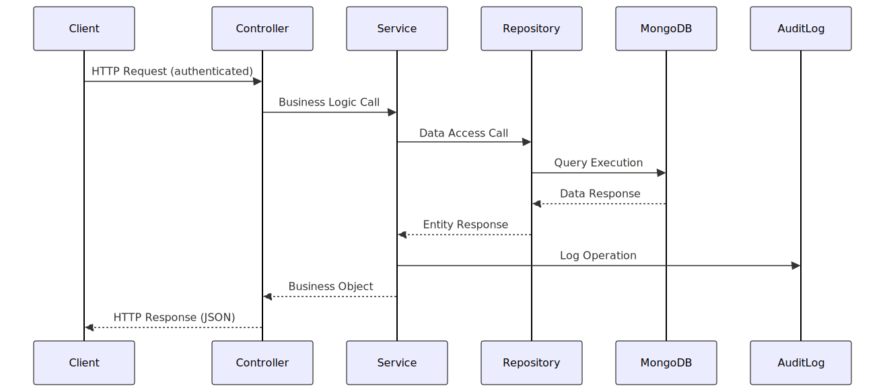

# FIAP - CHALLENGE SOFTTEK - SPRINT 2

## PROJETO SOFTCARE

Integrantes:

- Thiago Henrique Assi - RM 555570

## DIAGRAMAS DE ARQUITETURA DO BACKEND

> **SoftCare** é uma solução completa para oferecer suporte psicossocial e promover o bem-estar emocional dos colaboradores, desenvolvida com Spring Boot 3.5.6 e MongoDB.

### Estrutura de Dados

### Arquitetura Hexagonal

### Responsabilidades por Camada

### Fluxo de Dados

### Camadas de Segurança

## Endpoints

### Available authorizations
#### HTTPBasicAuthentication (HTTP, basic)
HTTP Basic Authentication. Use: admin / admin123  

---
## 👤 Usuários
API para gerenciamento de usuários do sistema SoftCare

### [GET] /api/v1/users/{id}
#### Parameters

| Name | Located in | Description | Required | Schema |
| ---- | ---------- | ----------- | -------- | ------ |
| id | path |  | Yes | string |

#### Responses

| Code | Description | Schema |
| ---- | ----------- | ------ |
| 200 | OK | ***/***: [UserResponse](#userresponse)  |

##### Security

| Security Schema | Scopes |
| --------------- | ------ |
| HTTPBasicAuthentication |  |

### [PUT] /api/v1/users/{id}
#### Parameters

| Name | Located in | Description | Required | Schema |
| ---- | ---------- | ----------- | -------- | ------ |
| id | path |  | Yes | string |

#### Request Body

| Required | Schema |
| -------- | ------ |
|  Yes | **application/json**: [CreateUserRequest](#createuserrequest)  |

#### Responses

| Code | Description | Schema |
| ---- | ----------- | ------ |
| 200 | OK | ***/***: [UserResponse](#userresponse)  |

##### Security

| Security Schema | Scopes |
| --------------- | ------ |
| HTTPBasicAuthentication |  |

### [DELETE] /api/v1/users/{id}
#### Parameters

| Name | Located in | Description | Required | Schema |
| ---- | ---------- | ----------- | -------- | ------ |
| id | path |  | Yes | string |

#### Responses

| Code | Description |
| ---- | ----------- |
| 200 | OK |

##### Security

| Security Schema | Scopes |
| --------------- | ------ |
| HTTPBasicAuthentication |  |

### [GET] /api/v1/users
#### Responses

| Code | Description | Schema |
| ---- | ----------- | ------ |
| 200 | OK | ***/***: [ [UserResponse](#userresponse) ]  |

##### Security

| Security Schema | Scopes |
| --------------- | ------ |
| HTTPBasicAuthentication |  |

### [POST] /api/v1/users
**Criar novo usuário**

Cria um novo usuário no sistema SoftCare. Este endpoint não requer autenticação.

#### Request Body

| Required | Schema |
| -------- | ------ |
|  Yes | **application/json**: [CreateUserRequest](#createuserrequest)  |

#### Responses

| Code | Description | Schema |
| ---- | ----------- | ------ |
| 201 | Usuário criado com sucesso | ***/***: [UserResponse](#userresponse)  |
| 400 | Dados inválidos fornecidos |  |
| 409 | Email já está em uso |  |

##### Security

| Security Schema | Scopes |
| --------------- | ------ |
| HTTPBasicAuthentication |  |

### [POST] /api/v1/users/{id}/change-password
#### Parameters

| Name | Located in | Description | Required | Schema |
| ---- | ---------- | ----------- | -------- | ------ |
| id | path |  | Yes | string |

#### Request Body

| Required | Schema |
| -------- | ------ |
|  Yes | **application/json**: [ChangePasswordRequest](#changepasswordrequest)  |

#### Responses

| Code | Description | Schema |
| ---- | ----------- | ------ |
| 200 | OK | ***/***: string  |

##### Security

| Security Schema | Scopes |
| --------------- | ------ |
| HTTPBasicAuthentication |  |

### [POST] /api/v1/users/login
#### Request Body

| Required | Schema |
| -------- | ------ |
|  Yes | **application/json**: [LoginRequest](#loginrequest)  |

#### Responses

| Code | Description | Schema |
| ---- | ----------- | ------ |
| 200 | OK | ***/***: string  |

##### Security

| Security Schema | Scopes |
| --------------- | ------ |
| HTTPBasicAuthentication |  |

### [GET] /api/v1/users/email/{email}
#### Parameters

| Name | Located in | Description | Required | Schema |
| ---- | ---------- | ----------- | -------- | ------ |
| email | path |  | Yes | string |

#### Responses

| Code | Description | Schema |
| ---- | ----------- | ------ |
| 200 | OK | ***/***: [UserResponse](#userresponse)  |

##### Security

| Security Schema | Scopes |
| --------------- | ------ |
| HTTPBasicAuthentication |  |

---
## Support Channels

### [GET] /api/v1/support-channels/{id}
#### Parameters

| Name | Located in | Description | Required | Schema |
| ---- | ---------- | ----------- | -------- | ------ |
| id | path |  | Yes | string |

#### Responses

| Code | Description | Schema |
| ---- | ----------- | ------ |
| 200 | OK | ***/***: [SupportChannel](#supportchannel)  |

### [PUT] /api/v1/support-channels/{id}
#### Parameters

| Name | Located in | Description | Required | Schema |
| ---- | ---------- | ----------- | -------- | ------ |
| id | path |  | Yes | string |

#### Request Body

| Required | Schema |
| -------- | ------ |
|  Yes | **application/json**: [SupportChannel](#supportchannel)  |

#### Responses

| Code | Description | Schema |
| ---- | ----------- | ------ |
| 200 | OK | ***/***: [SupportChannel](#supportchannel)  |

### [DELETE] /api/v1/support-channels/{id}
#### Parameters

| Name | Located in | Description | Required | Schema |
| ---- | ---------- | ----------- | -------- | ------ |
| id | path |  | Yes | string |

#### Responses

| Code | Description |
| ---- | ----------- |
| 200 | OK |

### [GET] /api/v1/support-channels
#### Responses

| Code | Description | Schema |
| ---- | ----------- | ------ |
| 200 | OK | ***/***: [ [SupportChannel](#supportchannel) ]  |

### [POST] /api/v1/support-channels
#### Request Body

| Required | Schema |
| -------- | ------ |
|  Yes | **application/json**: [SupportChannel](#supportchannel)  |

#### Responses

| Code | Description | Schema |
| ---- | ----------- | ------ |
| 200 | OK | ***/***: [SupportChannel](#supportchannel)  |

### [POST] /api/v1/support-channels/{id}/access
#### Parameters

| Name | Located in | Description | Required | Schema |
| ---- | ---------- | ----------- | -------- | ------ |
| id | path |  | Yes | string |
| userId | query |  | Yes | string |

#### Responses

| Code | Description | Schema |
| ---- | ----------- | ------ |
| 200 | OK | ***/***: string  |

### [GET] /api/v1/support-channels/with-website
#### Responses

| Code | Description | Schema |
| ---- | ----------- | ------ |
| 200 | OK | ***/***: [ [SupportChannel](#supportchannel) ]  |

### [GET] /api/v1/support-channels/with-phone
#### Responses

| Code | Description | Schema |
| ---- | ----------- | ------ |
| 200 | OK | ***/***: [ [SupportChannel](#supportchannel) ]  |

### [GET] /api/v1/support-channels/with-email
#### Responses

| Code | Description | Schema |
| ---- | ----------- | ------ |
| 200 | OK | ***/***: [ [SupportChannel](#supportchannel) ]  |

### [GET] /api/v1/support-channels/search/name
#### Parameters

| Name | Located in | Description | Required | Schema |
| ---- | ---------- | ----------- | -------- | ------ |
| name | query |  | Yes | string |

#### Responses

| Code | Description | Schema |
| ---- | ----------- | ------ |
| 200 | OK | ***/***: [ [SupportChannel](#supportchannel) ]  |

### [GET] /api/v1/support-channels/search/description
#### Parameters

| Name | Located in | Description | Required | Schema |
| ---- | ---------- | ----------- | -------- | ------ |
| text | query |  | Yes | string |

#### Responses

| Code | Description | Schema |
| ---- | ----------- | ------ |
| 200 | OK | ***/***: [ [SupportChannel](#supportchannel) ]  |

---
## Psychosocial Assessments

### [GET] /api/v1/psychosocial-assessments/{id}
#### Parameters

| Name | Located in | Description | Required | Schema |
| ---- | ---------- | ----------- | -------- | ------ |
| id | path |  | Yes | string |

#### Responses

| Code | Description | Schema |
| ---- | ----------- | ------ |
| 200 | OK | ***/***: [PsychosocialAssessment](#psychosocialassessment)  |

### [PUT] /api/v1/psychosocial-assessments/{id}
#### Parameters

| Name | Located in | Description | Required | Schema |
| ---- | ---------- | ----------- | -------- | ------ |
| id | path |  | Yes | string |

#### Request Body

| Required | Schema |
| -------- | ------ |
|  Yes | **application/json**: [CreatePsychosocialAssessmentRequest](#createpsychosocialassessmentrequest)  |

#### Responses

| Code | Description | Schema |
| ---- | ----------- | ------ |
| 200 | OK | ***/***: [PsychosocialAssessment](#psychosocialassessment)  |

### [DELETE] /api/v1/psychosocial-assessments/{id}
#### Parameters

| Name | Located in | Description | Required | Schema |
| ---- | ---------- | ----------- | -------- | ------ |
| id | path |  | Yes | string |

#### Responses

| Code | Description |
| ---- | ----------- |
| 200 | OK |

### [POST] /api/v1/psychosocial-assessments
#### Request Body

| Required | Schema |
| -------- | ------ |
|  Yes | **application/json**: [CreatePsychosocialAssessmentRequest](#createpsychosocialassessmentrequest)  |

#### Responses

| Code | Description | Schema |
| ---- | ----------- | ------ |
| 200 | OK | ***/***: [PsychosocialAssessment](#psychosocialassessment)  |

### [GET] /api/v1/psychosocial-assessments/user/{userId}
#### Parameters

| Name | Located in | Description | Required | Schema |
| ---- | ---------- | ----------- | -------- | ------ |
| userId | path |  | Yes | string |

#### Responses

| Code | Description | Schema |
| ---- | ----------- | ------ |
| 200 | OK | ***/***: [ [PsychosocialAssessment](#psychosocialassessment) ]  |

### [GET] /api/v1/psychosocial-assessments/user/{userId}/latest
#### Parameters

| Name | Located in | Description | Required | Schema |
| ---- | ---------- | ----------- | -------- | ------ |
| userId | path |  | Yes | string |

#### Responses

| Code | Description | Schema |
| ---- | ----------- | ------ |
| 200 | OK | ***/***: [PsychosocialAssessment](#psychosocialassessment)  |

### [GET] /api/v1/psychosocial-assessments/risk-level/{riskLevel}
#### Parameters

| Name | Located in | Description | Required | Schema |
| ---- | ---------- | ----------- | -------- | ------ |
| riskLevel | path |  | Yes | string,  **Available values:** "LOW", "MODERATE", "HIGH", "CRITICAL" |

#### Responses

| Code | Description | Schema |
| ---- | ----------- | ------ |
| 200 | OK | ***/***: [ [PsychosocialAssessment](#psychosocialassessment) ]  |

### [GET] /api/v1/psychosocial-assessments/high-risk
#### Responses

| Code | Description | Schema |
| ---- | ----------- | ------ |
| 200 | OK | ***/***: [ [PsychosocialAssessment](#psychosocialassessment) ]  |

### [GET] /api/v1/psychosocial-assessments/date-range
#### Parameters

| Name | Located in | Description | Required | Schema |
| ---- | ---------- | ----------- | -------- | ------ |
| startDate | query |  | Yes | dateTime |
| endDate | query |  | Yes | dateTime |

#### Responses

| Code | Description | Schema |
| ---- | ----------- | ------ |
| 200 | OK | ***/***: [ [PsychosocialAssessment](#psychosocialassessment) ]  |

---
## Emotional Diary

### [GET] /api/v1/emotional-diary/{id}
#### Parameters

| Name | Located in | Description | Required | Schema |
| ---- | ---------- | ----------- | -------- | ------ |
| id | path |  | Yes | string |

#### Responses

| Code | Description | Schema |
| ---- | ----------- | ------ |
| 200 | OK | ***/***: [EmotionalDiary](#emotionaldiary)  |

### [PUT] /api/v1/emotional-diary/{id}
#### Parameters

| Name | Located in | Description | Required | Schema |
| ---- | ---------- | ----------- | -------- | ------ |
| id | path |  | Yes | string |

#### Request Body

| Required | Schema |
| -------- | ------ |
|  Yes | **application/json**: [CreateEmotionalDiaryRequest](#createemotionaldiaryrequest)  |

#### Responses

| Code | Description | Schema |
| ---- | ----------- | ------ |
| 200 | OK | ***/***: [EmotionalDiary](#emotionaldiary)  |

### [DELETE] /api/v1/emotional-diary/{id}
#### Parameters

| Name | Located in | Description | Required | Schema |
| ---- | ---------- | ----------- | -------- | ------ |
| id | path |  | Yes | string |

#### Responses

| Code | Description |
| ---- | ----------- |
| 200 | OK |

### [POST] /api/v1/emotional-diary
#### Request Body

| Required | Schema |
| -------- | ------ |
|  Yes | **application/json**: [CreateEmotionalDiaryRequest](#createemotionaldiaryrequest)  |

#### Responses

| Code | Description | Schema |
| ---- | ----------- | ------ |
| 200 | OK | ***/***: [EmotionalDiary](#emotionaldiary)  |

### [GET] /api/v1/emotional-diary/user/{userId}
#### Parameters

| Name | Located in | Description | Required | Schema |
| ---- | ---------- | ----------- | -------- | ------ |
| userId | path |  | Yes | string |

#### Responses

| Code | Description | Schema |
| ---- | ----------- | ------ |
| 200 | OK | ***/***: [ [EmotionalDiary](#emotionaldiary) ]  |

### [GET] /api/v1/emotional-diary/user/{userId}/today
#### Parameters

| Name | Located in | Description | Required | Schema |
| ---- | ---------- | ----------- | -------- | ------ |
| userId | path |  | Yes | string |

#### Responses

| Code | Description | Schema |
| ---- | ----------- | ------ |
| 200 | OK | ***/***: boolean  |

### [GET] /api/v1/emotional-diary/user/{userId}/range
#### Parameters

| Name | Located in | Description | Required | Schema |
| ---- | ---------- | ----------- | -------- | ------ |
| userId | path |  | Yes | string |
| startDate | query |  | Yes | date |
| endDate | query |  | Yes | date |

#### Responses

| Code | Description | Schema |
| ---- | ----------- | ------ |
| 200 | OK | ***/***: [ [EmotionalDiary](#emotionaldiary) ]  |

### [GET] /api/v1/emotional-diary/user/{userId}/latest
#### Parameters

| Name | Located in | Description | Required | Schema |
| ---- | ---------- | ----------- | -------- | ------ |
| userId | path |  | Yes | string |

#### Responses

| Code | Description | Schema |
| ---- | ----------- | ------ |
| 200 | OK | ***/***: [EmotionalDiary](#emotionaldiary)  |

### [GET] /api/v1/emotional-diary/user/{userId}/date/{date}
#### Parameters

| Name | Located in | Description | Required | Schema |
| ---- | ---------- | ----------- | -------- | ------ |
| userId | path |  | Yes | string |
| date | path |  | Yes | date |

#### Responses

| Code | Description | Schema |
| ---- | ----------- | ------ |
| 200 | OK | ***/***: [EmotionalDiary](#emotionaldiary)  |

### [GET] /api/v1/emotional-diary/user/{userId}/average-wellness
#### Parameters

| Name | Located in | Description | Required | Schema |
| ---- | ---------- | ----------- | -------- | ------ |
| userId | path |  | Yes | string |
| startDate | query |  | Yes | date |
| endDate | query |  | Yes | date |

#### Responses

| Code | Description | Schema |
| ---- | ----------- | ------ |
| 200 | OK | ***/***: double  |

### [GET] /api/v1/emotional-diary/low-mood
#### Responses

| Code | Description | Schema |
| ---- | ----------- | ------ |
| 200 | OK | ***/***: [ [EmotionalDiary](#emotionaldiary) ]  |

### [GET] /api/v1/emotional-diary/high-stress
#### Responses

| Code | Description | Schema |
| ---- | ----------- | ------ |
| 200 | OK | ***/***: [ [EmotionalDiary](#emotionaldiary) ]  |

---
## Audit Logs

### [GET] /api/v1/audit-logs/user/{userId}
#### Parameters

| Name | Located in | Description | Required | Schema |
| ---- | ---------- | ----------- | -------- | ------ |
| userId | path |  | Yes | string |

#### Responses

| Code | Description | Schema |
| ---- | ----------- | ------ |
| 200 | OK | ***/***: [ [AuditLog](#auditlog) ]  |

### [GET] /api/v1/audit-logs/user/{userId}/recent
#### Parameters

| Name | Located in | Description | Required | Schema |
| ---- | ---------- | ----------- | -------- | ------ |
| userId | path |  | Yes | string |

#### Responses

| Code | Description | Schema |
| ---- | ----------- | ------ |
| 200 | OK | ***/***: [ [AuditLog](#auditlog) ]  |

### [GET] /api/v1/audit-logs/failed
#### Responses

| Code | Description | Schema |
| ---- | ----------- | ------ |
| 200 | OK | ***/***: [ [AuditLog](#auditlog) ]  |

### [GET] /api/v1/audit-logs/event-type/{eventType}
#### Parameters

| Name | Located in | Description | Required | Schema |
| ---- | ---------- | ----------- | -------- | ------ |
| eventType | path |  | Yes | string |

#### Responses

| Code | Description | Schema |
| ---- | ----------- | ------ |
| 200 | OK | ***/***: [ [AuditLog](#auditlog) ]  |

### [GET] /api/v1/audit-logs/critical
#### Responses

| Code | Description | Schema |
| ---- | ----------- | ------ |
| 200 | OK | ***/***: [ [AuditLog](#auditlog) ]  |

---
## Actuator
Monitor and interact
[Spring Boot Actuator Web API Documentation](https://docs.spring.io/spring-boot/docs/current/actuator-api/html/)

### [GET] /actuator
**Actuator root web endpoint**

#### Responses

| Code | Description | Schema |
| ---- | ----------- | ------ |
| 200 | OK | **application/vnd.spring-boot.actuator.v3+json**: object **application/json**: object **application/vnd.spring-boot.actuator.v2+json**: object  |

### [GET] /actuator/health
**Actuator web endpoint 'health'**

#### Responses

| Code | Description | Schema |
| ---- | ----------- | ------ |
| 200 | OK | **application/vnd.spring-boot.actuator.v3+json**: object **application/json**: object **application/vnd.spring-boot.actuator.v2+json**: object  |

### [GET] /actuator/health/**
**Actuator web endpoint 'health-path'**

#### Responses

| Code | Description | Schema |
| ---- | ----------- | ------ |
| 200 | OK | **application/vnd.spring-boot.actuator.v3+json**: object **application/json**: object **application/vnd.spring-boot.actuator.v2+json**: object  |

---
### Schemas

#### CreateUserRequest

Dados do usuário a ser criado

| Name | Type | Description | Required |
| ---- | ---- | ----------- | -------- |
| name | string |  | Yes |
| email | string |  | Yes |
| password | string |  | Yes |
| role | string,  **Available values:** "EMPLOYEE", "MANAGER", "SYSTEM_ADMIN" | *Enum:* `"EMPLOYEE"`, `"MANAGER"`, `"SYSTEM_ADMIN"` | Yes |

#### UserResponse

| Name | Type | Description | Required |
| ---- | ---- | ----------- | -------- |
| id | string |  | No |
| name | string |  | No |
| email | string |  | No |
| role | string,  **Available values:** "EMPLOYEE", "MANAGER", "SYSTEM_ADMIN" | *Enum:* `"EMPLOYEE"`, `"MANAGER"`, `"SYSTEM_ADMIN"` | No |
| createdAt | dateTime |  | No |
| updatedAt | dateTime |  | No |

#### SupportChannel

| Name | Type | Description | Required |
| ---- | ---- | ----------- | -------- |
| id | string |  | No |
| name | string |  | Yes |
| description | string |  | Yes |
| phoneNumber | string |  | No |
| email | string |  | No |
| website | string |  | No |
| createdAt | dateTime |  | No |
| updatedAt | dateTime |  | No |

#### CreatePsychosocialAssessmentRequest

| Name | Type | Description | Required |
| ---- | ---- | ----------- | -------- |
| userId | string |  | Yes |
| workStressLevel | integer |  | No |
| workLifeBalance | integer |  | No |
| jobSatisfaction | integer |  | No |
| relationshipWithColleagues | integer |  | No |
| personalWellbeing | integer |  | No |

#### PsychosocialAssessment

| Name | Type | Description | Required |
| ---- | ---- | ----------- | -------- |
| id | string |  | No |
| userId | string |  | Yes |
| workStressLevel | integer |  | No |
| workLifeBalance | integer |  | No |
| jobSatisfaction | integer |  | No |
| relationshipWithColleagues | integer |  | No |
| personalWellbeing | integer |  | No |
| overallScore | double |  | No |
| riskLevel | string,  **Available values:** "LOW", "MODERATE", "HIGH", "CRITICAL" | *Enum:* `"LOW"`, `"MODERATE"`, `"HIGH"`, `"CRITICAL"` | No |
| isComplete | boolean |  | No |
| createdAt | dateTime |  | No |
| updatedAt | dateTime |  | No |

#### CreateEmotionalDiaryRequest

| Name | Type | Description | Required |
| ---- | ---- | ----------- | -------- |
| userId | string |  | Yes |
| entryDate | date |  | Yes |
| moodLevel | string,  **Available values:** "VERY_LOW", "LOW", "NEUTRAL", "GOOD", "VERY_GOOD" | *Enum:* `"VERY_LOW"`, `"LOW"`, `"NEUTRAL"`, `"GOOD"`, `"VERY_GOOD"` | Yes |
| energyLevel | integer |  | No |
| stressLevel | integer |  | No |
| sleepQuality | integer |  | No |

#### EmotionalDiary

| Name | Type | Description | Required |
| ---- | ---- | ----------- | -------- |
| id | string |  | No |
| userId | string |  | Yes |
| entryDate | date |  | Yes |
| moodLevel | string,  **Available values:** "VERY_LOW", "LOW", "NEUTRAL", "GOOD", "VERY_GOOD" | *Enum:* `"VERY_LOW"`, `"LOW"`, `"NEUTRAL"`, `"GOOD"`, `"VERY_GOOD"` | Yes |
| energyLevel | integer |  | No |
| stressLevel | integer |  | No |
| sleepQuality | integer |  | No |
| createdAt | dateTime |  | No |
| updatedAt | dateTime |  | No |

#### ChangePasswordRequest

| Name | Type | Description | Required |
| ---- | ---- | ----------- | -------- |
| oldPassword | string |  | No |
| newPassword | string |  | No |

#### LoginRequest

| Name | Type | Description | Required |
| ---- | ---- | ----------- | -------- |
| email | string |  | Yes |
| password | string |  | Yes |

#### AuditLog

| Name | Type | Description | Required |
| ---- | ---- | ----------- | -------- |
| id | string |  | No |
| eventType | string |  | Yes |
| description | string |  | Yes |
| userId | string |  | No |
| userEmail | string |  | No |
| httpMethod | string |  | No |
| requestUrl | string |  | No |
| ipAddress | string |  | No |
| severity | string |  | No |
| resourceId | string |  | No |
| success | boolean |  | No |
| errorMessage | string |  | No |
| timestamp | dateTime |  | Yes |

#### Link

| Name | Type | Description | Required |
| ---- | ---- | ----------- | -------- |
| href | string |  | No |
| templated | boolean |  | No |
