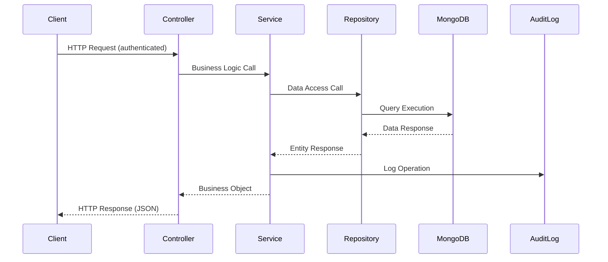
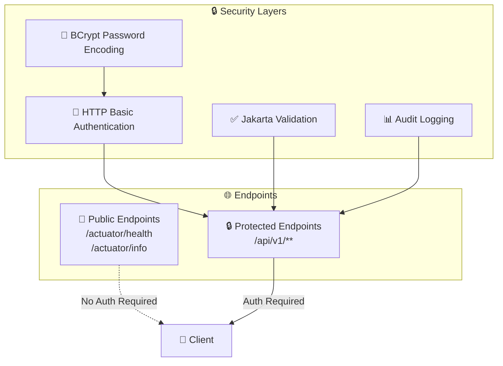
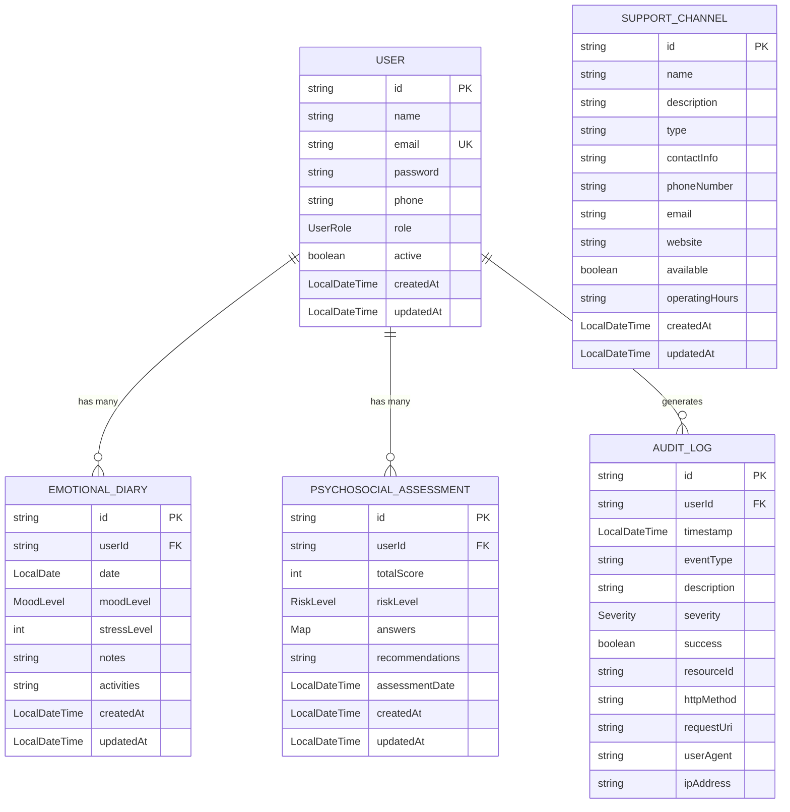
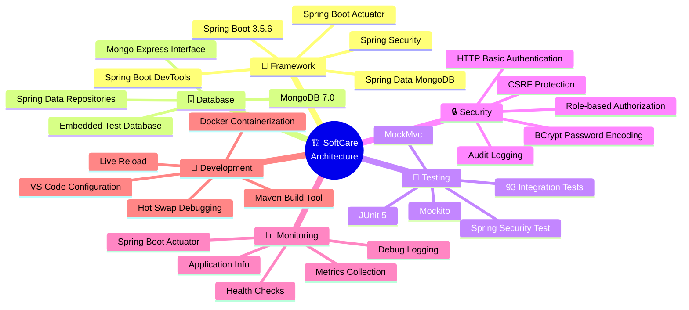

# 🏗️ Diagrama de Arquitetura - SoftCare Backend

## 📊 Arquitetura Hexagonal

```mermaid
graph TB
    %% External Layer
    subgraph "🌐 External Layer"
        CLIENT[👤 Client Applications]
        MONGO[🗄️ MongoDB Atlas]
        DOCKER[🐳 Docker Containers]
    end

    %% Interface Layer
    subgraph "🎯 Interface Layer (Controllers)"
        UC[👤 UserController<br/>CRUD Operations<br/>Authentication]
        SCC[📞 SupportChannelController<br/>Channel Management<br/>Search & Filters]
        EDC[📔 EmotionalDiaryController<br/>Diary Entries<br/>Wellness Analytics]
        PAC[🧠 PsychosocialAssessmentController<br/>Risk Assessment<br/>Evaluation Scoring]
        ALC[📊 AuditLogController<br/>Audit Queries<br/>Event Tracking]
    end

    %% Application Layer
    subgraph "🔧 Application Layer (Services)"
        US[👤 UserService<br/>User Business Logic<br/>Password Management<br/>Validation]
        SCS[📞 SupportChannelService<br/>Channel Logic<br/>Search Algorithms<br/>Availability]
        EDS[📔 EmotionalDiaryService<br/>Mood Analysis<br/>Wellness Calculation<br/>Statistics]
        PAS[🧠 PsychosocialAssessmentService<br/>Risk Calculation<br/>Assessment Logic<br/>Scoring]
        ALS[📊 AuditLogService<br/>Event Logging<br/>Security Tracking<br/>Analytics]
    end

    %% Domain Layer
    subgraph "📦 Domain Layer (Models & DTOs)"
        subgraph "🏷️ Models"
            UMODEL[👤 User<br/>- id, name, email<br/>- password, role<br/>- createdAt, updatedAt]
            SCMODEL[📞 SupportChannel<br/>- id, name, description<br/>- type, contactInfo<br/>- availability]
            EDMODEL[📔 EmotionalDiary<br/>- id, userId, date<br/>- moodLevel, notes<br/>- stressLevel, activities]
            PAMODEL[🧠 PsychosocialAssessment<br/>- id, userId, score<br/>- riskLevel, answers<br/>- recommendations]
            ALMODEL[📊 AuditLog<br/>- id, userId, timestamp<br/>- eventType, severity<br/>- details, success]
        end
        
        subgraph "📋 DTOs"
            DTOS[📨 Request/Response DTOs<br/>CreateUserRequest<br/>UserResponse<br/>LoginRequest<br/>CreateEmotionalDiaryRequest<br/>CreatePsychosocialAssessmentRequest]
        end
        
        subgraph "🏷️ Enums"
            ENUMS[🔤 Domain Enums<br/>UserRole<br/>MoodLevel<br/>RiskLevel<br/>EventTypes<br/>Severity]
        end
    end

    %% Infrastructure Layer
    subgraph "🗄️ Infrastructure Layer (Repositories)"
        UR[👤 UserRepository<br/>MongoDB Operations<br/>Email Queries<br/>Role Filtering]
        SCR[📞 SupportChannelRepository<br/>Search by Type<br/>Contact Filtering<br/>Availability Queries]
        EDR[📔 EmotionalDiaryRepository<br/>User Timeline<br/>Date Range Queries<br/>Mood Analytics]
        PAR[🧠 PsychosocialAssessmentRepository<br/>Risk Filtering<br/>User History<br/>Score Calculations]
        ALR[📊 AuditLogRepository<br/>Event Queries<br/>User Tracking<br/>Time-based Filters]
    end

    %% Configuration Layer
    subgraph "⚙️ Configuration Layer"
        SEC[🔒 SecurityConfig<br/>HTTP Basic Auth<br/>BCrypt Encoding<br/>Endpoint Protection]
        MONGO_CONF[🗄️ MongoConfig<br/>Database Connection<br/>Repository Scanning<br/>Connection Settings]
        APP[🚀 SoftcareApplication<br/>Spring Boot Main<br/>Auto Configuration<br/>Component Scanning]
    end

    %% External connections
    CLIENT --> UC
    CLIENT --> SCC
    CLIENT --> EDC
    CLIENT --> PAC
    CLIENT --> ALC

    %% Controller to Service connections
    UC --> US
    SCC --> SCS
    EDC --> EDS
    PAC --> PAS
    ALC --> ALS

    %% Service to Repository connections
    US --> UR
    SCS --> SCR
    EDS --> EDR
    PAS --> PAR
    ALS --> ALR

    %% Service to Model connections
    US --> UMODEL
    SCS --> SCMODEL
    EDS --> EDMODEL
    PAS --> PAMODEL
    ALS --> ALMODEL

    %% Repository to Database connections
    UR --> MONGO
    SCR --> MONGO
    EDR --> MONGO
    PAR --> MONGO
    ALR --> MONGO

    %% Configuration connections
    SEC --> UC
    SEC --> SCC
    SEC --> EDC
    SEC --> PAC
    SEC --> ALC
    
    MONGO_CONF --> UR
    MONGO_CONF --> SCR
    MONGO_CONF --> EDR
    MONGO_CONF --> PAR
    MONGO_CONF --> ALR

    %% Infrastructure
    DOCKER --> MONGO
    DOCKER --> APP

    %% Styling
    classDef controller fill:#e1f5fe
    classDef service fill:#f3e5f5
    classDef model fill:#e8f5e8
    classDef repository fill:#fff3e0
    classDef config fill:#fce4ec
    classDef external fill:#f5f5f5

    class UC,SCC,EDC,PAC,ALC controller
    class US,SCS,EDS,PAS,ALS service
    class UMODEL,SCMODEL,EDMODEL,PAMODEL,ALMODEL,DTOS,ENUMS model
    class UR,SCR,EDR,PAR,ALR repository
    class SEC,MONGO_CONF,APP config
    class CLIENT,MONGO,DOCKER external
```



## 🎯 Responsabilidades por Camada

```mermaid
graph TB
    subgraph "🌐 Presentation Layer"
        subgraph "🎯 Controllers"
            UC["👤 UserController<br/>• CRUD Operations<br/>• Authentication<br/>• Password Management<br/>• User Validation"]
            SCC["📞 SupportChannelController<br/>• Channel Management<br/>• Search & Filters<br/>• Contact Information<br/>• Availability Tracking"]
            EDC["📔 EmotionalDiaryController<br/>• Diary Entry Management<br/>• Mood Tracking<br/>• Wellness Analytics<br/>• Timeline Queries"]
            PAC["🧠 PsychosocialAssessmentController<br/>• Risk Assessment<br/>• Evaluation Scoring<br/>• Recommendations<br/>• Progress Tracking"]
            ALC["📊 AuditLogController<br/>• Security Logging<br/>• Event Tracking<br/>• Access Monitoring<br/>• Compliance Reports"]
        end
    end

    subgraph "🔧 Business Layer"
        subgraph "💼 Services"
            US["👤 UserService<br/>• Business Logic<br/>• Password Validation<br/>• Role Management<br/>• Account Lifecycle"]
            SCS["📞 SupportChannelService<br/>• Channel Logic<br/>• Search Algorithms<br/>• Contact Validation<br/>• Availability Logic"]
            EDS["📔 EmotionalDiaryService<br/>• Mood Analysis<br/>• Wellness Calculation<br/>• Statistical Analysis<br/>• Trend Detection"]
            PAS["🧠 PsychosocialAssessmentService<br/>• Risk Calculation<br/>• Score Aggregation<br/>• Recommendation Engine<br/>• Assessment Logic"]
            ALS["📊 AuditLogService<br/>• Event Processing<br/>• Security Analysis<br/>• Compliance Tracking<br/>• Alert Generation"]
        end
    end

    subgraph "📦 Domain Layer"
        subgraph "🏗️ Core Models"
            UMODEL["👤 User Entity<br/>• Identity Management<br/>• Profile Information<br/>• Security Attributes<br/>• Lifecycle Tracking"]
            SCMODEL["📞 SupportChannel Entity<br/>• Channel Information<br/>• Contact Details<br/>• Service Availability<br/>• Operational Data"]
            EDMODEL["📔 EmotionalDiary Entity<br/>• Mood Records<br/>• Daily Entries<br/>• Emotional State<br/>• Activity Tracking"]
            PAMODEL["🧠 PsychosocialAssessment Entity<br/>• Assessment Data<br/>• Risk Metrics<br/>• Evaluation Results<br/>• Recommendations"]
            ALMODEL["📊 AuditLog Entity<br/>• Event Records<br/>• Security Data<br/>• Compliance Info<br/>• Access Traces"]
        end
    end

    subgraph "🗄️ Data Layer"
        subgraph "📊 Repositories"
            UR["👤 UserRepository<br/>• User Persistence<br/>• Email Queries<br/>• Role Filtering<br/>• Account Lookup"]
            SCR["📞 SupportChannelRepository<br/>• Channel Storage<br/>• Search Operations<br/>• Filter Queries<br/>• Availability Checks"]
            EDR["📔 EmotionalDiaryRepository<br/>• Entry Persistence<br/>• Timeline Queries<br/>• Mood Analytics<br/>• Date Filtering"]
            PAR["🧠 PsychosocialAssessmentRepository<br/>• Assessment Storage<br/>• Risk Queries<br/>• Score Analytics<br/>• History Tracking"]
            ALR["📊 AuditLogRepository<br/>• Log Persistence<br/>• Event Queries<br/>• Security Tracking<br/>• Compliance Reports"]
        end
    end

    subgraph "⚙️ Infrastructure Layer"
        subgraph "🔧 Configuration"
            SEC["🔒 SecurityConfig<br/>• Authentication Setup<br/>• Authorization Rules<br/>• Password Encoding<br/>• Endpoint Protection"]
            MONGO_CONF["🗄️ MongoConfig<br/>• Database Connection<br/>• Repository Configuration<br/>• Index Management<br/>• Query Optimization"]
        end
        
        subgraph "🗄️ Database"
            MONGODB["🍃 MongoDB<br/>• Document Storage<br/>• Index Management<br/>• Query Processing<br/>• Transaction Support"]
        end
    end

    %% Connections
    UC --> US
    SCC --> SCS
    EDC --> EDS
    PAC --> PAS
    ALC --> ALS

    US --> UMODEL
    SCS --> SCMODEL
    EDS --> EDMODEL
    PAS --> PAMODEL
    ALS --> ALMODEL

    US --> UR
    SCS --> SCR
    EDS --> EDR
    PAS --> PAR
    ALS --> ALR

    UR --> MONGODB
    SCR --> MONGODB
    EDR --> MONGODB
    PAR --> MONGODB
    ALR --> MONGODB

    SEC -.-> UC
    SEC -.-> SCC
    SEC -.-> EDC
    SEC -.-> PAC
    SEC -.-> ALC

    MONGO_CONF -.-> UR
    MONGO_CONF -.-> SCR
    MONGO_CONF -.-> EDR
    MONGO_CONF -.-> PAR
    MONGO_CONF -.-> ALR
```



## 🔄 Fluxo de Dados



## 🛡️ Camadas de Segurança



## 📊 Estrutura de Dados



## 🔌 Tecnologias e Padrões



## 📁 Estrutura de Pacotes

```
br.com.fiap.softcare/
├── 🚀 SoftcareApplication.java          # Main Application Class
├── 🎯 controller/                       # REST Controllers Layer
│   ├── UserController.java
│   ├── SupportChannelController.java
│   ├── EmotionalDiaryController.java
│   ├── PsychosocialAssessmentController.java
│   └── AuditLogController.java
├── 🔧 service/                          # Business Logic Layer
│   ├── UserService.java
│   ├── SupportChannelService.java
│   ├── EmotionalDiaryService.java
│   ├── PsychosocialAssessmentService.java
│   └── AuditLogService.java
├── 📦 model/                            # Domain Entities
│   ├── User.java
│   ├── SupportChannel.java
│   ├── EmotionalDiary.java
│   ├── PsychosocialAssessment.java
│   └── AuditLog.java
├── 🗄️ repository/                       # Data Access Layer
│   ├── UserRepository.java
│   ├── SupportChannelRepository.java
│   ├── EmotionalDiaryRepository.java
│   ├── PsychosocialAssessmentRepository.java
│   └── AuditLogRepository.java
├── 📋 dto/                              # Data Transfer Objects
│   ├── CreateUserRequest.java
│   ├── UserResponse.java
│   ├── LoginRequest.java
│   ├── CreateEmotionalDiaryRequest.java
│   └── CreatePsychosocialAssessmentRequest.java
├── 🏷️ enums/                            # Domain Enumerations
│   ├── UserRole.java
│   ├── MoodLevel.java
│   └── RiskLevel.java
└── ⚙️ config/                           # Configuration Classes
    ├── SecurityConfig.java
    └── MongoConfig.java
```
